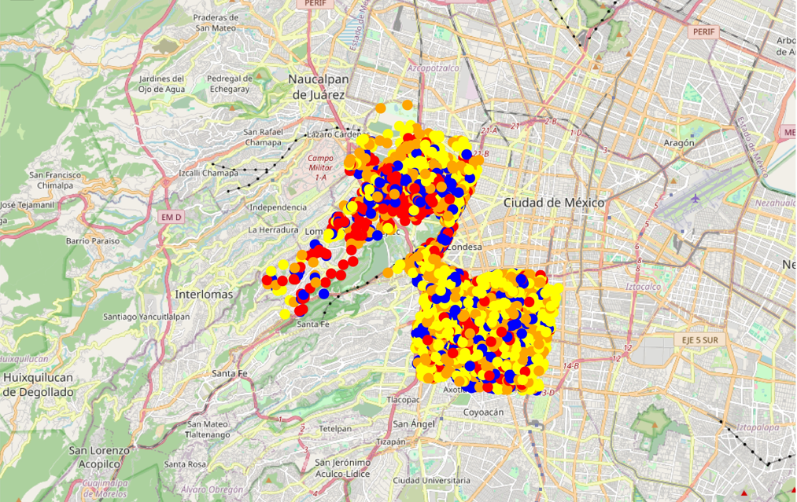

# 🏨 Mercado Inmobiliario
### *Utilizar metodología de Discovery para obtener insights acerca del mercado inmobiliario en la CDMX*

---

## Proyecto
Analizar los datos que el líder del sector AirBnb hace públicos para intentar encontrar los tipos de inmuebles que tienen mayor potencial comercial para alquier turístico.

## Objetivo
Localizar el perfil (o perfiles) de inmuebles que maximizan el potencial comercial en el mercado del alquiler turístico y las principales zonas donde buscarlos. 

## Demo

  

